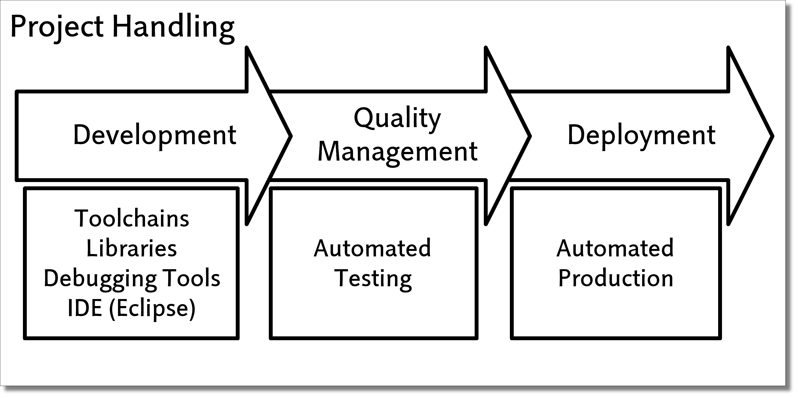
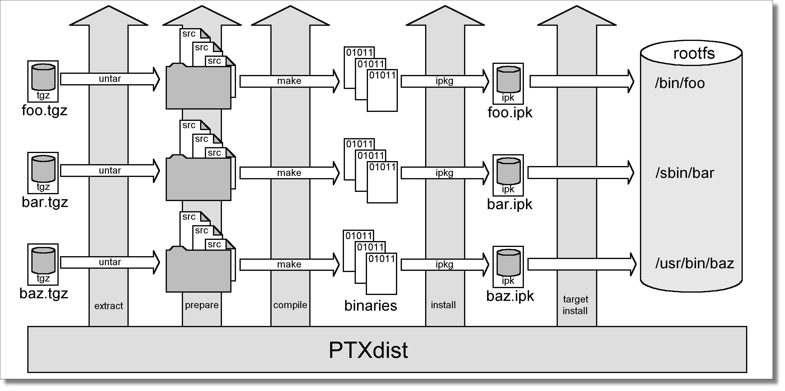
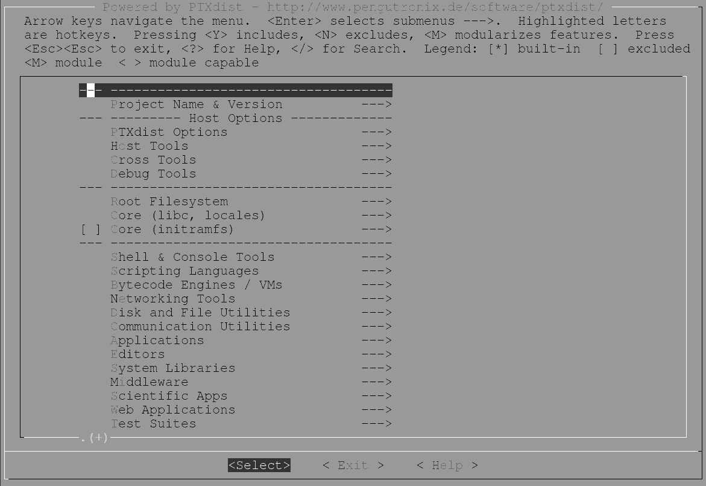

PTXdist User’s Manual
=====================

This chapter should give any newbie the information he/she needs to be
able to handle any embedded Linux projects based on PTXdist. Also the
advanced user may find new valueable information.

How does it work?
-----------------

PTXdist supports various aspects of the daily work to develop, deploy
and maintain an embedded Linux based project.

   Objectives in a project

The most important part is the development. For this project phase,
PTXdist provides features to ensure reproducibility and verifiability.

PTXdist’s perception of the world
~~~~~~~~~~~~~~~~~~~~~~~~~~~~~~~~~

PTXdist works project centric. A PTXdist project contains all
information and files to populate any kind of target system with all
required software components.

-  Specific configuration for

   -  Bootloader

   -  Kernel

   -  Userland (root filesystem)

-  Adapted files (or generic ones) for runtime configuration

-  Patches for all kind of components (to fix bugs or improve features)

Some of these information or files are coming from the PTXdist base
installation (patches for example), but also can be part of the project
itself. By this way, PTXdist can be adapted to any kind of requirement.

Most users are fine with the information and files the PTXdist base
installation provides. Development of PTXdist is done in a way to find
default settings most user can work with. But advanced users can still
adapt it to their special needs.

As stated above, a PTXdist project consists of all required parts, some
of these parts are separated by design: PTXdist separates a platform
configuration from userland configuration (root filesystem). So,
platforms can share a common userland configuration, but use a specific
kernel configuration in their own platform configuration.

Collecting various platforms into one single project should help to
maintain such projects. But some platforms do need special userland
(think about graphic/non graphic platforms). To be able to also collect
this requirement into one single project, so called *collections* are
supported. With this feature, a user can configure a full featured main
userland, reduced via a collection by some components for a specific
platform where it makes no sense to build and ship them.

A different use case for collections could be the security of an
application. While the development is ongoing all kind of debugging and
logging helpers are part of the root filesystem. But the final
production root filesystem uses collections to omit all these helpers
and to reduce the risc of security vulnerability.

PTXdist can handle the following project variations:

-  one hardware platform, one userland configuration (common case)

-  one hardware platform, various userland configurations

-  various hardware platforms, one userland configuration (common case)

-  various hardware platforms, one userland configuration, various
   collections

-  various hardware platforms, various userland configuration

-  various hardware platforms, various userland configuration, various
   collections

PTXdist’s build process
~~~~~~~~~~~~~~~~~~~~~~~

When PTXdist is building one part (we call it a *package*) of the whole
project, it is divided into up to six stages:

   The build process

**get**
    The package will be obtained from its source (downloaded from the
    web for example)

**extract**
    The package archive gets extracted and patched if a patch set for
    this package exists

**prepare**
    Many packages can be configured in various ways. If supported, this
    stage does the configuration in a way defined in the menu (project
    specific)

**compile**
    The package gets built.

**install**
    The package installs itself into a project local directory. This
    step is important at least for libraries (other packages may depend
    on)

**targetinstall**
    Relevant parts of the package will be used to build an IPKG archive
    and the root filesystem

For each single package, one so called *rule file* exists, describing
the steps to be done in each stage shown above (refer section
:ref:`rulefile` for further details).

Due to the *get* stage, PTXdist needs a working internet connection to
download an archive currently not existing on the development host. But
there are ways to prevent PTXdist from doing so (refer to section
:ref:`source-arch-loc`).

First steps with PTXdist
------------------------

PTXdist works as a console command tool. Everything we want PTXdist to
do, we have to enter as a command. But it’s always the same base
command:

::

    $ ptxdist <parameter>

To run different functions, this command must be extended by parameters
to define the function we want to run.

If we are unsure what parameter must be given to obtain a special
function, we run it with the parameter *help*.

::

    $ ptxdist help

This will output all possible parameters ans subcommands and their
meaning.

As the list we see is very long, let’s explain the major parameters
usually needed for daily usage:

``menu``
    This starts a dialog based frontend for those who do not like typing
    commands. It will gain us access to the most common parameters to
    configure and build a PTXdist project.

``menuconfig``
    Starts the Kconfig based project configurator for the current
    selected userland configuration. This menu will give us access to
    various userland components that the root filesystem of our target
    should consist of.

``menuconfig platform``
    Starts the Kconfig based platform configurator. This menu lets us
    set up all target specific settings. Major parts are:

    -  Toolchain (architecture and revision)

    -  boot loader

    -  root filesystem image type

    -  Linux kernel (revision)

    Note: A PTXdist project can consist of more than one platform
    configuration at the same time.

``menuconfig kernel``
    Runs the standard Linux kernel Kconfig to configure the kernel for
    the current selected platform. To run this feature, the kernel must
    be already set up for this platform.

``menuconfig collection``
    If multiple platforms are sharing one userland configuration,
    collections can define a subset of all selected packages for
    specific platforms. This is an advanced feature, rarely used.

``toolchain``
    Sets up the path to the toolchain used to compile the current
    selected platform. Without an additional parameter, PTXdist tries
    to guess the toolchain from platform settings. To be successful,
    PTXdist depends on the OSELAS.Toolchains installed to the ``/opt``
    directory.
    If PTXdist wasn’t able to autodetect the toolchain, an additional
    parameter can be given to provide the path to the compiler,
    assembler, linker and so on.

``select``
    Used to select the current userland configuration, which is only
    required if there is no ``selected_ptxconfig`` in the project’s main
    directory. This parameter needs the path to a valid ``ptxconfig``.
    It will generate a soft link called ``selected_ptxconfig`` in the
    project’s main directory.

``platform``
    Used to select the current platform configuration, which is only
    required if there is no ``selected_platformconfig`` in the project’s
    main directory. This parameter needs the path to a valid
    ``platformconfig``. It will generate a soft link called
    ``selected_platformconfig`` in the project’s main directory.

``collection``
    Used to select the current collection configuration, which is only
    required in special cases. This parameter needs the path to a valid
    ``collection``. It will generate a soft link called
    ``selected_collection`` in the project’s main directory. This is an
    advanced feature, rarely used.

``go``
    The mostly used command. This will start to build everything to get
    all the project defined software parts. Also used to rebuild a part
    after its configuration was changed.

``images``
    Used at the end of a build to create an image from all userland
    packages to deploy the target (its flash for example or its hard
    disk).

``setup``
    Mostly run once per PTXdist revision to set up global paths and the
    PTXdist behavior.

For a more complete description refer :ref:`ptxdist_parameter_reference`

All these commands depending on various files a PTXdist based project
provides. So, running the commands make only sense in directorys that
contains a PTXdist based project. Otherwise PTXdist gets confused and
confuses the user with funny error messages.

To show the usage of some listed major subcommands, we are using a
generic PTXdist based project.

Extracting the Board Support Package
~~~~~~~~~~~~~~~~~~~~~~~~~~~~~~~~~~~~

In order to work with a PTXdist based project we have to extract the
archive first.

.. parsed-literal::

    $ tar -zxf |ptxdistBSPName|\ .tar.gz
    $ cd |ptxdistBSPName|

PTXdist is project centric, so now after changing into the new directory
we have access to all valid components.

::

  total 32
  -rw-r--r-- 1 jb users 1060 Jul  1 16:33 ChangeLog
  -rw-r--r-- 1 jb users  741 Jul  1 15:12 README
  drwxr-xr-x 5 jb users 4096 Jul  1 15:17 configs
  drwxr-xr-x 3 jb users 4096 Jul  1 16:51 documentation
  drwxr-xr-x 5 jb users 4096 Jul  1 15:12 local_src
  drwxr-xr-x 4 jb users 4096 Jul  1 15:12 patches
  drwxr-xr-x 5 jb users 4096 Jul  1 15:12 projectroot
  drwxr-xr-x 3 jb users 4096 Jul  1 15:12 rules

Notes about some of the files and directories listed above:

**ChangeLog**
    Here you can read what has changed in this release. Note: This file
    does not always exist.

**documentation**
    If this BSP is one of our OSELAS BSPs, this directory contains the
    Quickstart you are currenly reading in.

**configs**
    A multiplatform BSP contains configurations for more than one
    target. This directory contains the respective platform
    configuration files.

**projectroot**
    Contains files and configuration for the target’s runtime. A running
    GNU/Linux system uses many text files for runtime configuration.
    Most of the time, the generic files from the PTXdist installation
    will fit the needs. But if not, customized files are located in this
    directory.

**rules**
    If something special is required to build the BSP for the target it
    is intended for, then this directory contains these additional
    rules.

**patches**
    If some special patches are required to build the BSP for this
    target, then this directory contains these patches on a per package
    basis.

**tests**
    Contains test scripts for automated target setup.

Next we will build the to show some of PTXdist’s main features.

Selecting a Userland Configuration
~~~~~~~~~~~~~~~~~~~~~~~~~~~~~~~~~~

First of all we have to select a userland configuration. This step
defines what kind of applications will be built for the hardware
platform. The comes with a predefined configuration we select in the
following step:

::

    $ ptxdist select configs/ptxconfig
    info: selected ptxconfig:
          'configs/ptxconfig'

Selecting a Hardware Platform
~~~~~~~~~~~~~~~~~~~~~~~~~~~~~

Before we can build this BSP, we need to select one of the possible
platforms to build for. In this case we want to build for the :

.. parsed-literal::

    $ ptxdist platform configs/\ |ptxdistPlatformName|\ /platformconfig\ |ptxdistPlatformVariant|
    info: selected platformconfig:
          'configs/\ |ptxdistPlatformName|\ /platformconfig\ |ptxdistPlatformVariant|\ '

.. note:: If you have installed the OSELAS.Toolchain() at its default
  location, PTXdist should already have detected the proper toolchain
  while selecting the platform. In this case it will output:

.. parsed-literal::

    found and using toolchain:
    '/opt/OSELAS.Toolchain-\ |oselasTCNVendorVersion|\ |oselasTCNVendorPatchLevel|\ /\ |ptxdistCompilerName|\ /\
    |ptxdistCompilerVersion|\ /bin'

If it fails you can continue to select the toolchain manually as
mentioned in the next section. If this autodetection was successful, we
can omit the steps of the section and continue to build the BSP.

In the unified, one included platform can use more userland features
than another. For example platforms with graphic features will also
build graphic support, but platforms sans display do not need it. To
speed up compilation for specific platforms PTXdist provides
collections, to reduce the amount of programs to be compiled for
specific cases.

To reduce the package count for the run:

.. parsed-literal::

    $ ptxdist collection configs/\ |ptxdistPlatformCollection|
    info: selected collectionconfig:
          'configs/\ |ptxdistPlatformCollection|\ '

Selecting a Toolchain
~~~~~~~~~~~~~~~~~~~~~

If not automatically detected, the last step in selecting various
configurations is to select the toolchain to be used to build everything
for the target.

.. parsed-literal::

    $ ptxdist toolchain /opt/OSELAS.Toolchain-\ |oselasTCNVendorVersion|\ |oselasTCNVendorPatchLevel|\ /\ |ptxdistCompilerName|\ /\ |ptxdistCompilerVersion|\ /bin

Building the Root Filesystem Content
~~~~~~~~~~~~~~~~~~~~~~~~~~~~~~~~~~~~

Now everything is prepared for PTXdist to compile the BSP. Starting the
engines is simply done with:

::

    $ ptxdist go

PTXdist does now automatically find out from the ``selected_ptxconfig``
and ``selected_platformconfig`` files which packages belong to the
project and starts compiling their *targetinstall* stages (that one that
actually puts the compiled binaries into the root filesystem). While
doing this, PTXdist finds out about all the dependencies between the
packages and builds them in correct order.

What we Got Now
~~~~~~~~~~~~~~~

After building the project, we find even more sub directories in our
project.

|ptxdistPlatformDir|\ ``/build-cross``
    Contains all packages sources compiled to run on the host and handle
    target architecture dependend things.

|ptxdistPlatformDir|\ ``/build-host``
    Contains all packages sources compiled to run on the host and handle
    architecture independend things.

|ptxdistPlatformDir|\ ``/build-target``
    Contains all package sources compiled for the target architecure.

|ptxdistPlatformDir|\ ``/images``
    Generated files for the target can be found here: Kernel image and
    root filesystem image.

|ptxdistPlatformDir|\ ``/packages``
    Location for alle individual packages in ipk format.

|ptxdistPlatformDir|\ ``/sysroot-target``
    Contains everything target architecture dependend (libraries, header
    files and so on).

|ptxdistPlatformDir|\ ``/sysroot-cross``
    Contains everything that is host specific but must handle target
    architecture data.

|ptxdistPlatformDir|\ ``/sysroot-host``
    Contains everything that is only host specific.

|ptxdistPlatformDir|\ ``/root``
    Target’s root filesystem image. This directory can be mounted as
    an NFS root for example.

|ptxdistPlatformDir|\ ``/root-debug``
    Target’s root filesystem image. The difference to ``root/`` is,
    all programs and libraries in this directory still have their
    debug information present. This directory is intended to be used
    as system root for a debugger. To be used by the debugger, you
    should setup your debugger with
    ``set solib-absolute-prefix </path/to/workspace>/root-debug``

|ptxdistPlatformDir|\ ``/state``
    Building every package is divided onto stages. And stages of one
    package can depend on stages of other packages. In order to handle
    this correctly, this directory contains timestamp files about
    finished stages.

This are the generated files:

|ptxdistPlatformDir|\ ``/logfile``
    Every run of PTXdist will add its output to this file. If something
    fails, this file can help to find the cause.

Creating a Root Filesystem Image
~~~~~~~~~~~~~~~~~~~~~~~~~~~~~~~~

After we have built the root filesystem content, we can make an image,
which can be flashed to the target system or copied on some kind of disk
media. To do so, we just run

::

    $ ptxdist images

PTXdist now extracts the content of priorly created *\*.ipk* packages to
a temporary directory and generates an image out of it. PTXdist supports
following image types:

- **hd.img:** contains bootloader, kernel and root files in an ext2
- partition. Mostly used for X86 target systems.

- **root.jffs2:** root files inside a jffs2 filesystem.

- **uRamdisk:** a u-boot loadable Ramdisk

- **initrd.gz:** a traditional initrd RAM disk to be used as initrdramfs
- by the kernel

- **root.ext2:** root files inside an ext2 filesystem.

- **root.squashfs:** root files inside a squashfs filesystem.

- **root.tgz:** root files inside a plain gzip compressed tar ball.

All these files can be found in ``images`` if enabled.

Running all Parts in an emulated Environment (QEMU)
~~~~~~~~~~~~~~~~~~~~~~~~~~~~~~~~~~~~~~~~~~~~~~~~~~~

The is prepared to give every user a chance to run the results of the
previous steps even in the absense of real hardware. All we need is a
working QEMU on our development host.

Simply run

.. parsed-literal::

    $ ./configs/\ |ptxdistPlatformName|\ /run

This will start QEMU in full system emulation mode and runs the
previously built kernel which then uses the generated disk image to
bring up a full Linux based system.

The running system uses a serial device for its communication. QEMU
forwards this emulated device to the current development host console.
So, we can watch the starting kernel’s output and log in on this system.

Note: Log in as user ’\ ``root``\ ’ with no password (just enter).

Also a telnet deamon is running in this emulation. QEMU is configured to
forward the standard telnet port 23 of the emulated system to host’s
port 4444. To connect to the emulated system, we can just run a

::

    $ telnet localhost 4444
    Trying 127.0.0.1...
    Connected to localhost.
    Escape character is '^]'.

    ptx login: root
    root@ptx:~

Leaving the emulated environment happens by entering the key sequence
*CTRL-A X* in the development host console.

Adapting the |ptxdistBSPName| Project
-------------------------------------

Handling a fully prepared PTXdist project is easy. But everything is
fixed to the settings the developer selected. We now want to adapt the
project in a few simple settings.

Working with Kconfig
~~~~~~~~~~~~~~~~~~~~

Whenever we modify our project, PTXdist is using *Kconfig* to manipulate
the settings. *Kconfig* means *kernel configurator* and was mainly
developed to configure the Linux kernel itself. But it is easy to adapt,
to use and so popular that more and more projects are using *Kconfig*
for their purposes. PTXdist is one of them.

What is Kconfig
^^^^^^^^^^^^^^^

It is a user interface to select given resources in a convenient way.
The resources that we can select are given in simple text files. It uses
a powerful “language” in these text files to organize them in a
hierarchical manner, solves challenges like resource dependencies,
supports help and search features. PTXdist uses all of these features.
*Kconfig* supports a text based user interface by using the *ncurses*
library to manipulate the screen content and should work on nearly all
host systems.

For example running PTXdist’s ``menuconfig`` subcommand in this way

::

    $ ptxdist menuconfig

will show the following console output

   Main userland configuration menu

Navigate in Kconfig menu (select, search, ...)
^^^^^^^^^^^^^^^^^^^^^^^^^^^^^^^^^^^^^^^^^^^^^^

To navigate through the configuration tree, we are using the arrow keys.
Up and down navigates vertically in the menu entries. Right and left
navigates between *Select*, *Exit* and *Help* (in the bottom part of our
visual screen).

To enter one of the menus, we navigate to this entry to highlight it and
press the *Enter* key. To leave it, we select *Exit* and press the
*Enter* key again. There are shortcuts available, instead of pressing
the *Enter* key to enter a menu we also can press *alt-s* and to leave a
menu *alt-e*. Also an ESC double hit leaves any menu we are in.

To select a menu entry, we use the *Space* key. This will toggle the
selection. Or, to be more precise and faster, we use the key *y* to
select an entry, and key *n* to deselect it.

To get help for a specific menu topic, we navigate vertically to
highlight it and horizontally to select the *Help* entry. Then we can
press *Enter* to see the help.

To search for specific keywords, we press the */* key and enter a word.
Kconfig then lists all occurences of this word in all menus.

Meaning of visual feedbacks in Kconfig
^^^^^^^^^^^^^^^^^^^^^^^^^^^^^^^^^^^^^^

-  | Submenus to enter are marked with a trailing ``--->``
   | Note: Some submenus are also marked with a leading bracket ``[ ]``.
     To enter them we first must select/enable them ``[*]``

-  Entries with a list of selectable alternatives are also marked with a
   trailing ``--->``

-  Entries we can select are marked with a leading empty bracket ``[ ]``

-  Entries that are already selected are marked with a leading filled
   bracket ``[*]``

-  Entries that are selected due to dependencies into other selected
   entries are marked with a leading ``-*-``

-  Some entries need a free text to enter, they are marked with leading
   brackets ``()`` and the free text in it

Menus and submenus in Kconfig (sectioning)
^^^^^^^^^^^^^^^^^^^^^^^^^^^^^^^^^^^^^^^^^^

There are dozens of entries in the PTXdist configuring menus. To handle
them, they are divided and separated into logical units.

The main building blocks in the *userland configuration* menu are:

-  Host Options: Some parts of the project are build host relevant only.
   For example PTXdist can build the DDD debugger to debug applications
   running on the target.

-  Root Filesystem: Settings to arrange target’s root filesystem and to
   select the main C runtime library

-  Applications: Everything we like to run on your target.

The main building blocks in the *platform configuration* menu are:

-  Architecture: Basic settings, like the main and sub architecture the
   target system uses, the toolchain to be used to build everything and
   some other architecture dependent settings.

-  Linux kernel: Which kernel revision and kernel configuration should
   be used

-  Bootloader: Which bootloader (if any) should be built in the project

-  The kind of image to populate a root filesystem into the target
   system

The main building blocks in the *board setup configuration* menu are:

-  Network: Network settings for the target

-  Host: Host setup to be able to reach the target system

At this point it could be useful to walk to the whole menus and their
submenus to get an idea about the amount of features and applications
PTXdist currently supports.

Adapting Platform Settings
~~~~~~~~~~~~~~~~~~~~~~~~~~

Some parts of the |ptxdistBSPName| project are platform specific (in contrast to the
userland configuration that could be shared between platforms). We now
want to change the used Linux kernel of our current platform. It comes
with a default linux-3.19 and we want to change it to a more recent
linux-4.0.

To do so, we run:

::

    $ ptxdist menuconfig platform

In this Kconfig dialogue we navigate to the entry:

.. parsed-literal::

    Linux kernel  --->
        (\ |ptxdistPlatformKernelRev|\ ) kernel version

and replace the 3.19 value by the 4.0 value.

Since PTXdist checks the MD5 sums of the archives it uses, we also must
change the MD5 sum in the menu entry according to the selected kernel
version.

Now we can leave the menu and save the new settings.

A Linux kernel needs a configuration for being built correctly. The
project comes with a prepared configuration in the file
configs/\ |ptxdistPlatformName|\ /kernelconfig-3.0 for the 3.0 kernel.

It is always a good idea to start with a known-to-work kernel
configuration. So, for this example, we are using a different
known-to-work kernel configuration in the configs/\ |ptxdistPlatformName|\ /kernelconfig-3.7
file for our new 3.7 kernel.

Adapting Linux Kernel Settings
~~~~~~~~~~~~~~~~~~~~~~~~~~~~~~

In this section we want to show how to change some Linux kernel settings
of our project.

First of all, we run

::

    $ ptxdist menuconfig kernel

This command will start the kernel’s Kconfig. For this example we want
to enable USB host support in the kernel. To do so, we navigate to:

::

    Device Drivers  --->
        [ ] USB support  --->
            < > Support for Host-side USB
                < > OHCI HCD support

Note: All the listed empty ``[ ]`` and ``< >`` above must be activated
to get all submenu entries.

We leave the menu and save the new kernel configuration.

To start building a new kernel with the new configuration, we again run:

::

    $ ptxdist go

This builds or re-builds the kernel, because we changed its settings.

Note: If nothing was changed, ``ptxdist go`` also will do nothing.

When PTXdist has finished its job, the new bootable kernel can be found
at ``images/linuximage``. To boot it again in the QEMU emulation, the
hard disk image must be re-created with:

.. parsed-literal::

    $ ptxdist images
    $ ./configs/\ |ptxdistPlatformName|\ /run

The emulated system should now start with a 3.7 based kernel with USB
support.

Adapting Userland Settings
~~~~~~~~~~~~~~~~~~~~~~~~~~

After changing some platform and kernel settings, we are now reaching
the most interesting area: Userland.

In the userland area we can enable and use all the applications and
services PTXdist provides. Many of them are working out of the box when
enabled and executed on the target side. Some need additional runtime
configuration, but PTXdist comes with most common configurations for
such packages.

In this simple example, we want to add the missing ``head`` command to
our target’s shell. Assuming we forgot to enable this command, we get:

.. parsed-literal::

    $ ./configs/\ |ptxdistPlatformName|\ /run

    ptx login: root
    login[xxx]: root login on 'ttyS0'
    root@ptx:~ head /etc/fstab
    -sh: head: not found

To change this, we first run:

::

    $ ptxdist menuconfig

The additional command we want to enable is provided by the *Busybox*
package. So we navigate to:

::

    Shell & Console Tools --->
        -*- busybox  --->
            Coreutils  --->
                [ ] head

After activating the ``[ ] head`` entry, we leave the menu and save the
new configuration.

Once again, a

::

    $ ptxdist go

will build or re-build the busybox package due to its configuration
change.

And also once again, after finishing its job, the following commands let
us test the new command:

.. parsed-literal::

    $ ptxdist images
    $ ./configs/|ptxdistPlatformName|/run

Log in on the emulated system and simply check with a:

::

    ptx login: root
    login[xxx]: root login on 'ttyS0'
    root@ptx:~ head /etc/fstab
    #
    # /etc/fstab
    #

    # special filesystems
    proc    /proc                   proc    defaults                        0 0
    debugfs /sys/kernel/debug       debugfs defaults,noauto                 0 0
    devpts  /dev/pts                devpts  defaults                        0 0
    none    /tmp                    tmpfs   defaults,mode=1777,uid=0,gid=0  0 0
    none    /sys                    sysfs   defaults                        0 0

We are done now. These simple examples should give the users a quick
feeling how things are working in PTXdist and how to modify them.
Adapting this generic BSP to a different platform with nearly the same
features as our reference platforms is possible with this knowledge.

But most of the time, a user needs more detailed adaptions to be able to
fit all requirements of the new platform. At this point of time we are
no longer ordinary users of PTXdist, we become developers now.

So, right now it’s time to read the *PTXdist Developer’s Manual*

